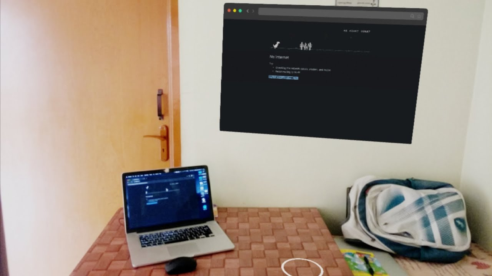

# Selenium Augmented Reality Experiment:

Experimental project to extend the fun of selenium by using augmented reality features to stream the live execution of browser in android device.

# Sample screenshot:



### Check the demo in youtube: 
https://youtu.be/lCEZfHTFSd0

# Setup:

Clone the repo 
````
https://github.com/sudharsan-selvaraj/selenium-augmented-reality.git
````
and check the following docs to setup the server and client applications

Refer  [this](socket-server)  to setup server application.\
Refer [this](selenium-ar-app)  to android application.
